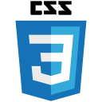
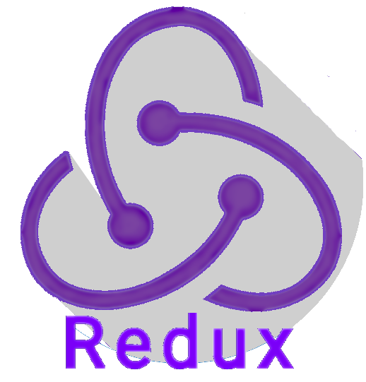
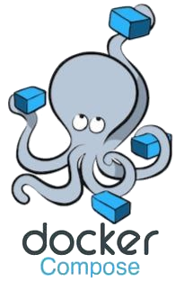

  <h1>"Hello World!", me chamo Anderson.</h1>

  <ul>
    <li>👨🏽‍💻 Acabo de me formar em Desenvolvimento Web FullStack, onde aprofundei meus conhecimentos em <b>back-end</b> e <b>front-end</b></li>
    <li>No desenvolvimento <b>BACK END</b> tive algumas experiências durante essa trajetoria com algumas tecnologias como Node.js, Express, SQL, NoSQL, dentre outras. </li>
    <li>Já em <b>FRONT END</b> experienciei tecnologias como ReactJS, Redux, TypeScript, além de varias outras durante minha formação. </li>
    <li>:brain: Estou em constante busca por conhecimento para evoluir na minha carreira de desenvolvedora e 
  progredir nas boas práticas de programação</li>
    <li>📝 Veja meu currículo <a href="#" target="_blank">clicando aqui</a></li>
  </ul>
  

<!-- Quadro status  -->

  <a href="https://github.com/Andersonp-Silva25">
  
  

<!-- Skills  -->

  <h1></h1>

  <table>
    <tr>
      <td><b>Linguagens</b></td>
      <td></td>
    </tr>
  </table>
  <table>
    <tr>
      <td><b>Tecnologias</b></td>
      <td>
        
        
        
        
        
        
        
        
        
      </td>
    </tr>
  </table>
  <table>
    <tr>
      <td><b>Ferramentas</b></td>
      <td>
        
        
        
        
        
        
        
      </td>
    </tr>
  </table>

  <!-- Redes sociais  -->

  <h1></h1>

  <h3>Redes Sociais</h3>
  

